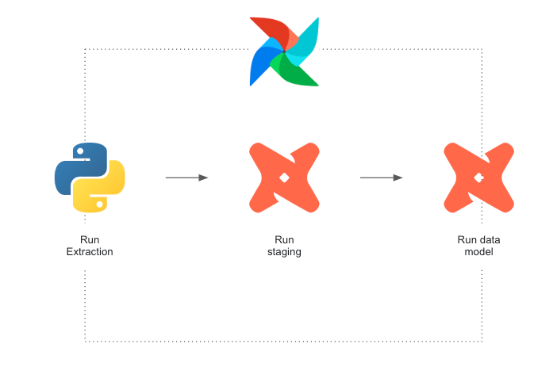

# Regen

Regen is an end-to-end application that showcases how to train and deploy 
reinforcement learning trading agents on environments that conform to the 
[Farama's Env](https://gymnasium.farama.org/api/env/) interface. The tech stack is both 
modern and open-source, making it easy to work with and build upon. With Regen, you'll 
gain valuable insight into how to develop powerful and flexible trading agents.

## Project Focus

The objective of this project is to offer a set of architecture components
that are required to create a complete trading application. This includes ELT pipelines
for acquiring data for environments, which comprises both historical data for training
agents and backtesting, as well as live data for deployments. The environments serve as
interfaces for agents to trade assets, while the agents themselves are designed to define
the policies for executing trades. 

## Requirements
|            | Version                | 
|------------|------------------------|
| Terraform  | 1.3.7                  | 
| Docker     | 20.10.22               |

## ELT
All the ELT infrastructure is defined as Terraform code inside the directory
`infra`

The ELT pipeline in this project is managed through 
[Airflow](https://github.com/apache/airflow). The extraction layer 
includes python tasks that extract data from sources in batches and load it into a 
Postgres database that serves as the data warehouse. Once the data is in the warehouse,
transformations are carried out using [dbt](https://www.getdbt.com/) modules to create
the observations table that
is used by the environment. Currently, there is a single pipeline that generates the 
observations table for the single crypto-asset environment.

## Environments
Environments are interfaces to expose data that agents need to make decisions, 
additionally, they execute actions the agents make at a specified step, episode and 
execution. they are subclasses of [Farama's Env](https://gymnasium.farama.org/api/env/).
Currently, there is a single environment available, which is the single crypto-asset
environment.

### Single crypto-asset environment
An environment that provides data about a specific cryptocurrency asset at a given minute,
an observation is made up of 11 features: open value, highest value, lowest value, 
close value, and 7 moving averages data points (with 7, 25, 100, 300, 1440, 
14400, 144000 window sizes) in the last minute.

## Agents
Agents choose actions in an environment. At the moment, only the deep 
reinforcement learning agent is available.

### Deep Reinforcement Learning Agent
An agent that relies on deep reinforcement learning algorithms to build
policies. [stable-baselines3](https://stable-baselines3.readthedocs.io/en/master/)
implementations are used.

## Getting Started
### Set up infrastructure
1. go to the infra folder `cd infra`
2. run `terraform apply` to deploy infrastructure
### Train
#### Single crypto-asset
1. Trigger the `klines_backfill`, `ma_backfill` and `dbt_run` DAG's in 
sequence that should be available in the Airflow server in
`http://localhost:8080/` to put historical data in the observations table that is hosted
by the `regen_db` container.
2. Run `docker exec agent python main.py -t` to train the agent.

### Run in live mode
Run `docker exec agent python main.py -l` to run in live mode. This mode 
requires __load_from_execution_id__ config variable to be defined.
### Parameters
**bnb_base_urls:** List of URL's to connect to the Binance 
[api](https://github.com/binance/binance-spot-api-docs/blob/master/rest-api.md#klinecandlestick-data).

**bnb_client_key:** Binance api secret.

**db_file_location:** Location of the database file when using SQLite engine.

**base_asset:** Asset to accumulate in the single crypto-asset environment.

**quote_asset:** Quote asset in the single crypto-asset environment.

**window_size:** Number of consecutive records per observation.

**ticks_per_episode:** Max number of steps per episode.

**time_steps:** Total number of time steps to train the agent.

**output_dir:** Path to the directory to store output files.

**db_type:** Type of database engine to use. Only `sql` and `postgres` are
supported at the moment.

**load_from_execution_id:** Id of the previous execution to load a pretrained
model from.

**env_logging_lvl:** Level of the logs to flush into the log files.

**obs_table:** Name of the observations table.

**db_schema:** Name of the schema where the observations table is.

## Disclaimer
This software is for educational purposes only. It is not intended to be used with real money.
Do not risk money which you are afraid to lose. 
USE THE SOFTWARE AT YOUR OWN RISK. 
THE AUTHOR ASSUME NO RESPONSIBILITY FOR YOUR TRADING RESULTS.
